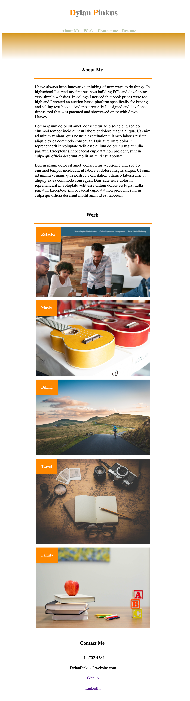

# Portfolio-1

## Description

This is an assignment to start building our portfolio, including many of the lessons I have learned so far in the class.

- Portfolio's are very important in showcasing work to potential clients and employers
- Showcasing work provides direct examples of programming abilities to share with others
- This project specifically helped reinforce CSS properties like flex boxes and media queries 

## Built with
CsSS & HTML

## Screenshot

## Website Link
https://dpinkus87.github.io/Portfolio-1/
                                                    
(https://github-readme-stats.vercel.app/api?username=dpinkus87)]

